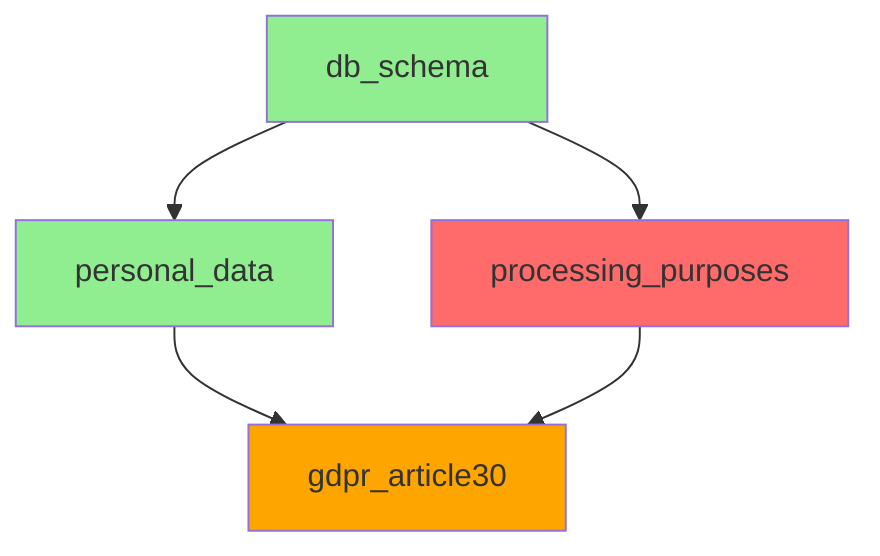

# DAG Orchestration Evolution

- **Status:** Phase 1 Complete, Phase 2 Planning
- **Last Updated:** 2025-12-09
- **Related:** [Artifact-Centric Runbook](./artifact-centric-runbook.md), [Execution Persistence](./execution-persistence.md)

## Current State

Phase 1 orchestration is complete (see [implementation](../architecture/artifact-centric-orchestration.md)): Planner validates runbooks and builds execution plans; DAGExecutor runs artifacts in parallel using `graphlib.TopologicalSorter`. The system handles dependency resolution, schema validation, and basic error propagation.

**Foundation capabilities:**
- Parallel execution respecting dependencies
- Schema compatibility validation at plan time
- Multi-schema fan-in support for analysers
- Error propagation (skip dependents on failure)

## Remaining Challenges

**Observability gap:** Execution happens in-memory with minimal visibility. No way to inspect artifacts after execution, understand why steps failed, or visualise execution flow.

**Persistence gap:** Results exist only during execution. Cannot re-export, audit historical runs, or build on previous analysis without re-execution.

**Debugging difficulty:** No step-through capability, limited insight into data flowing between artifacts, hard to diagnose schema mismatches or transformation issues.

## Phase 2: Enhanced Observability and Debugging

### Design Goals

1. **Artifact inspection** - View artifact contents and metadata after execution
2. **Execution replay** - Understand what happened during historical runs
3. **Visual debugging** - See data flow and dependencies
4. **Step-through execution** - Debug runbooks interactively

### Artifact Inspection

**Problem:** Artifacts only exist during execution. Cannot inspect what data flowed between steps or diagnose issues post-execution.

**Design:**

```bash
# View artifact contents from past run
wct inspect <run-id> <artifact-id>

# Example
wct inspect run_20251209_143022 personal_data_findings
```

**Requirements:**
- ExecutionStore persists execution metadata (run ID, timestamps, status, errors)
- ArtifactStore persists artifact messages (schema, content, metadata)
- Run ID correlates execution with artifacts

**See:** [Execution Persistence](./execution-persistence.md) for storage design.

### DAG Visualisation

**Problem:** Hard to understand runbook execution flow, dependency relationships, and critical path.

**Design:**

```bash
# Generate visual DAG from runbook
wct visualise <runbook> --format mermaid

# Show execution status (requires run ID)
wct visualise <runbook> --run <run-id>
```

**Output example (Mermaid):**



**Status colours:**
- Green: Completed successfully
- Red: Failed
- Orange: Skipped (dependency failed)
- Grey: Not yet executed

**Considerations:**
- Use Planner to generate DAG (no execution needed)
- Mermaid format for GitHub/docs integration
- DOT format for Graphviz rendering
- Optional: Load execution status from persisted run

### Step-Through Debugger

**Problem:** Cannot debug runbook execution interactively. Must add logging and re-run entire workflow.

**Design:**

```bash
# Run with breakpoints
wct debug <runbook>

# Interactive session
[wct-debug] Breaking before artifact: personal_data_findings
[wct-debug] Input schemas: standard_input:1.0.0
[wct-debug] Commands: continue (c), inspect (i), skip (s), quit (q)
> i db_schema
{
  "schema": "standard_input:1.0.0",
  "content": { "items": [...] }
}
> c
[wct-debug] Breaking after artifact: personal_data_findings
[wct-debug] Output: 42 findings, 3 high-risk
> c
```

**Implementation approach:**
- DebugExecutor variant with breakpoint support
- Interactive shell (cmd/prompt_toolkit)
- Pause before/after each artifact
- Inspect inputs, outputs, configuration
- Continue, skip, or abort execution

**Considerations:**
- CLI-only (no GUI)
- Breakpoints configurable via flag or runbook annotation
- Must integrate with existing error handling

### Execution Timeline Analysis

**Problem:** Cannot identify performance bottlenecks or understand parallel execution efficiency.

**Design:**

```bash
wct timeline <run-id>
```

**Output:**
```
Execution Timeline (run_20251209_143022)
Total: 45.2s | Parallel efficiency: 78%

00:00 ████████████ db_schema (12.3s)
00:12 ████████ personal_data (8.1s)
00:12 ██████████ processing_purposes (10.2s)
00:22 ███████████████████ gdpr_article30 (19.4s)

Critical path: db_schema → processing_purposes → gdpr_article30 (41.9s)
```

**Considerations:**
- Requires ExecutionStore with artifact timing
- Show wall-clock time, not CPU time
- Identify critical path (longest dependency chain)
- Calculate parallel efficiency (actual time vs sequential time)
- Useful for optimising expensive analysers

## Phase 3: Advanced Execution Modes

### Distributed Execution

**Problem:** Large runbooks with expensive analysers cannot scale beyond single machine.

**Design considerations:**
- DAGExecutor variant that dispatches artifacts to remote workers
- Worker pool (Docker containers, Lambda functions, etc.)
- Centralized ArtifactStore for data passing
- Requires serializable artifact messages (already true)

**Challenges:**
- Network reliability and retry logic
- Cost management (LLM API calls distributed across workers)
- Debugging distributed failures

**Not planned:** This requires significant infrastructure investment. Current single-machine execution is sufficient for foreseeable workloads.

### Dry-Run Mode

**Problem:** Want to validate runbook without executing connectors or analysers.

**Design:**

```bash
wct run <runbook> --dry-run
```

**Behaviour:**
- Planner validates runbook (schema compatibility, cycles, missing refs)
- Executor generates mock artifacts matching declared schemas
- No actual connector/analyser execution
- Shows execution plan and predicted data flow

**Use cases:**
- Runbook development and testing
- CI validation before deployment
- Schema compatibility verification

## Design Principles

**Simplicity:** Use stdlib where possible (`graphlib.TopologicalSorter`, `asyncio`). Avoid orchestration frameworks.

**Separation:** Planner validates and builds plan; Executor runs it. Clean interface enables multiple executor variants.

**Fail-fast:** Schema validation at plan time, not runtime. Errors caught before expensive execution.

**Observable:** Execution visibility through logging, persistence, and inspection tools. No black-box execution.

**Non-goals:** No distributed execution, no workflow persistence beyond artifact storage, no complex retry logic. Keep orchestration layer thin.

## Implementation Dependencies

**Phase 2 (Observability):**
- Execution Persistence (ExecutionStore + ArtifactStore) - Required for inspection and timeline
- Planner DAG generation (already exists) - Required for visualisation
- Rich terminal UI library (optional) - For better debugging experience

**Phase 3 (Advanced Modes):**
- Serializable artifact transport - Required for distributed execution
- Mock schema generators - Required for dry-run mode
- Worker orchestration infrastructure - Required for distributed execution

## Related Documents

- [Execution Persistence](./execution-persistence.md) - Storage design for inspection and replay
- [Artifact-Centric Runbook](./artifact-centric-runbook.md) - Runbook format
- [Dynamic and Agentic Workflows](./dynamic-and-agentic-workflows.md) - Adaptive execution
- [Artifact-Centric Orchestration](../architecture/artifact-centric-orchestration.md) - Phase 1 implementation
